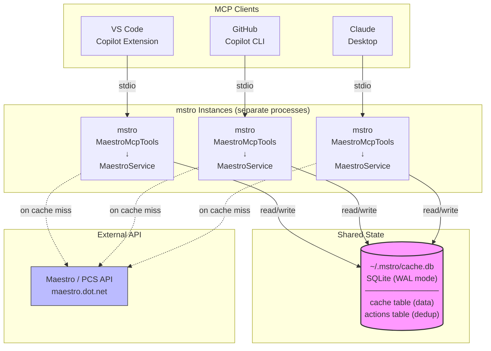

[](#status)
[](#how-it-works)
[](https://www.nuget.org/packages/lewing.maestro.mcp)

# maestro.mcp — MCP server & CLI for Maestro/BAR dependency flow data

An MCP server **and standalone CLI tool** that provides cached access to [Maestro/BAR](https://maestro.dot.net) (Build Asset Registry) data for the .NET build infrastructure. Exposes 19 tools for querying subscriptions, builds, channels, and health status, plus triggering subscription updates and managing cache via the Model Context Protocol. Also works as a standalone CLI (`mstro`) for humans — same cached data, same authentication, no AI required.

Built with [Squad](https://github.com/bradygaster/squad) — [meet the squad](.ai-team/SQUAD.md).

## Why mstro?

The Maestro/BAR API powers .NET's dependency flow infrastructure, but working with it directly is painful:

- **Subscription IDs are GUIDs** — you need to query by repo/channel, not memorize UUIDs
- **Build staleness requires multi-step lookup** — compare last-applied build vs latest available, then compute commit distance via GitHub
- **No cross-process caching** — every `darc` invocation hits the API fresh, even for data that changes every 5–15 minutes
- **Codeflow status is opaque** — backflow PRs, tracked PRs, and subscription history are scattered across multiple API endpoints

`mstro` wraps all of this in a single tool with **smart caching** (SQLite, shared across all MCP clients), **automatic authentication** (reuses `darc` Entra ID credentials), and **enriched output** (commit distance, health scoring, freshness checks). Whether you're an AI agent investigating a stale subscription or a human triaging build flow, you get the same fast, accurate answers.

## Installation

### Run with dnx (no install needed)

`dnx` (new in .NET 10) auto-downloads and runs NuGet tool packages — no install step required:

```bash
dnx lewing.maestro.mcp
```

This is the recommended approach for MCP server configuration (see below). MCP stdio mode is the default.

### Install as Global Tool

```bash
dotnet tool install -g lewing.maestro.mcp
```

For repo-local installation via a [tool manifest](https://learn.microsoft.com/dotnet/core/tools/local-tools-how-to-use):

```bash
dotnet new tool-manifest   # if .config/dotnet-tools.json doesn't exist
dotnet tool install --local lewing.maestro.mcp
```

### Install from Local Build

```bash
dotnet pack src/MaestroTool
dotnet tool install -g --add-source src/MaestroTool/nupkg lewing.maestro.mcp
```

After installation, `mstro` is available globally.

### Build from Source

```bash
# Prerequisites: .NET 10 SDK
git clone https://github.com/lewing/maestro.mcp.git
cd maestro.mcp
dotnet build
```

> **NuGet feed requirement:** The `Microsoft.DotNet.ProductConstructionService.Client` package is published to the
> [dotnet-eng](https://pkgs.dev.azure.com/dnceng/public/_packaging/dotnet-eng/nuget/v3/index.json)
> Azure Artifacts feed. The included `nuget.config` references this feed.

## Quick Start — CLI

`mstro` is a full CLI for humans. Every query uses the same cached API layer as the MCP server.

```bash
# List subscriptions for a repo
mstro subscriptions --source-repository https://github.com/dotnet/runtime

# Get a specific subscription by ID
mstro subscription <guid>

# Check subscription health for a target repo (includes commit distance)
mstro subscription-health https://github.com/dotnet/sdk --include-commit-details

# Get the latest build for a repo on a channel
mstro latest-build https://github.com/dotnet/runtime --channel-name ".NET 10.0.1xx SDK"

# Get a specific build by ID
mstro build 302353

# List all channels
mstro channels

# List default channel mappings
mstro default-channels --repository https://github.com/dotnet/runtime

# Check build freshness via aka.ms
mstro build-freshness ".NET 10.0.1xx SDK"

# List active codeflow (backflow) PRs
mstro codeflow-prs --channel-name ".NET 10 Engineering"

# Get tracked PR for a subscription
mstro tracked-pr <guid>

# Get backflow status for a VMR build
mstro backflow-status 302627

# View subscription update history
mstro subscription-history <guid>

# Get build dependency graph
mstro build-graph 302353

# Get dependency flow graph for a channel
mstro flow-graph 1234 --days 14

# Trigger a subscription update (requires auth)
mstro trigger-subscription <guid> 302353

# Trigger all daily subscriptions (requires auth)
mstro trigger-daily-update

# Cache management
mstro cache status
mstro cache clear
```

All commands support `--json` for structured output and `--no-cache` to bypass the cache.

### Interactive Detection

`mstro` automatically detects how it's launched:

| Context | Behavior |
|---------|----------|
| **Terminal (no args)** | Shows `--help` with available commands |
| **MCP host (stdin piped)** | Starts MCP server mode automatically |
| **With subcommand** | Runs the specified CLI command |

This means existing MCP configurations (`"command": "mstro"` with no args) continue to work unchanged — `mstro` detects the piped stdin and enters MCP server mode.

## MCP Configuration

Add the following to your MCP client config. The `--yes` flag ensures `dnx` doesn't prompt for confirmation:

```json
{
  "servers": {
    "maestro": {
      "type": "stdio",
      "command": "dnx",
      "args": ["lewing.maestro.mcp", "--yes"]
    }
  }
}
```

> If you've installed `lewing.maestro.mcp` as a global tool, you can use `"command": "mstro"` with `"args": []` instead of `dnx`.

### With authentication

```json
{
  "servers": {
    "maestro": {
      "type": "stdio",
      "command": "dnx",
      "args": ["lewing.maestro.mcp", "--yes"],
      "env": {
        "MAESTRO_BAR_TOKEN": "your-token-here"
      }
    }
  }
}
```

### HTTP server (alternative)

```bash
dotnet run --project src/MaestroTool.Mcp
```

The HTTP server listens on **http://localhost:5000** by default.

### Config file locations

| Client | Config file | Top-level key |
|--------|------------|---------------|
| **GitHub Copilot CLI** | `~/.copilot/mcp.json` | `servers` |
| **VS Code / GitHub Copilot** | `.vscode/mcp.json` | `servers` |
| **Claude Desktop** (macOS) | `~/Library/Application Support/Claude/claude_desktop_config.json` | `mcpServers` |
| **Claude Desktop** (Windows) | `%APPDATA%\Claude\claude_desktop_config.json` | `mcpServers` |
| **Claude Code / Cursor** | `.cursor/mcp.json` | `mcpServers` |

## Authentication

The server implements a **3-tier authentication cascade**:

1. **Explicit PAT** — Set `MAESTRO_BAR_TOKEN` environment variable
2. **Cached Entra ID** — Reuses credentials from `darc authenticate` (`~/.darc/.auth-record-*`)
3. **Anonymous** — Read-only fallback (may be rate-limited)

**Recommended**: Run `darc authenticate` once (from [arcade-services](https://github.com/dotnet/arcade-services)) to cache credentials, then rely on automatic Entra ID authentication.

## Action Tools

The server includes **action tools** for triggering subscription updates. These are non-destructive operations — they trigger processing but don't delete or modify subscription configuration.

### Deduplication

Action tools include built-in deduplication with a 2-minute cooldown. If the same action is triggered again within the cooldown window, the server returns a notice instead of re-executing. This prevents duplicate triggers from LLM retries or multiple concurrent skills.

### Destructive Actions (future)

Future versions may include destructive actions (delete subscription, remove default channel, etc.). These will be **disabled by default** and require an explicit opt-in:

```json
{
  "servers": {
    "maestro": {
      "type": "stdio",
      "command": "dnx",
      "args": ["lewing.maestro.mcp", "--yes"],
      "env": {
        "MAESTRO_ENABLE_DESTRUCTIVE_ACTIONS": "true"
      }
    }
  }
}
```

## Available Tools

The server registers **19 MCP tools** for querying and triggering Maestro/BAR operations:

| Tool Name | Description | Key Parameters |
|-----------|-------------|-----------------|
| `maestro_subscriptions` | List all subscriptions | `sourceRepository`, `targetRepository`, `channelName`, `targetBranch` (all optional filters); `noCache`: bypass cache |
| `maestro_subscription` | Get a single subscription by ID | `subscriptionId`: UUID; `noCache`: bypass cache |
| `maestro_latest_build` | Get the latest build from a channel | `channelId`: channel ID; `sourceRepository`: source repo URL; `noCache`: bypass cache |
| `maestro_build` | Get a build by ID | `buildId`: build ID; `noCache`: bypass cache |
| `maestro_builds` | List builds, optionally filtered by repository, channel, commit, or build number | `repository`, `channelName`, `commit`, `buildNumber`, `count` (all optional); `noCache`: bypass cache |
| `maestro_channels` | List all channels | `noCache`: bypass cache |
| `maestro_channel` | Get a specific channel by ID | `channelId`: channel ID; `noCache`: bypass cache |
| `maestro_default_channels` | Get default channels for a repository | `repository`: source repository URL; `noCache`: bypass cache |
| `maestro_subscription_health` | Get health status of a subscription (awaiting build, failed, etc.) | `subscriptionId`: UUID; `noCache`: bypass cache |
| `maestro_build_freshness` | Check how long since a source repository branch was built | `sourceRepository`: source repo URL; `branch`: branch name; `noCache`: bypass cache |
| `maestro_trigger_subscription` | Trigger a subscription to process a specific build | `subscriptionId`: UUID; `buildId`: BAR build ID |
| `maestro_trigger_daily_update` | Trigger all daily-update subscriptions | None |
| `maestro_codeflow_prs` | List active codeflow (backflow) tracked PRs, optionally filtered by channel | `channelName` (optional); `noCache`: bypass cache |
| `maestro_codeflow_pr` | Get the tracked PR for a specific subscription by ID | `subscriptionId`: UUID; `noCache`: bypass cache |
| `maestro_backflow_status` | Get backflow status for a VMR build | `vmrBuildId`: build ID; `noCache`: bypass cache |
| `maestro_subscription_history` | Get update history for a subscription | `subscriptionId`: UUID; `noCache`: bypass cache |
| `maestro_build_graph` | Get the full dependency graph for a build | `buildId`: BAR build ID; `noCache`: bypass cache |
| `maestro_flow_graph` | Get the dependency flow graph for a channel | `channelId`: channel ID; `days`: lookback (default 7); `includeArcade`, `includeBuildTimes`, `includeDisabledSubscriptions` (optional bools); `noCache`: bypass cache |
| `maestro_clear_cache` | Clear the shared SQLite cache | None |

### Naming Convention

Tools follow a consistent naming pattern:

```
maestro_{resource}               # get one by ID (e.g. maestro_build)
maestro_{resources}              # list (e.g. maestro_builds)
maestro_{resource}_{aspect}      # detail query (e.g. maestro_subscription_health)
maestro_{verb}_{resource}        # action (e.g. maestro_trigger_subscription)
```

### Cache Bypass

All read tools accept an optional `noCache` boolean parameter. When set to `true`, the cached entry for that request is invalidated before fetching, guaranteeing a fresh API call. Use this after triggering actions or when investigating rapidly changing state.

The `maestro_clear_cache` tool provides a full cache reset — useful when doing bulk operations or debugging stale data.

### Codeflow Tracking

The `maestro_codeflow_prs`, `maestro_codeflow_pr`, `maestro_backflow_status`, and `maestro_subscription_history` tools expose the same PCS PullRequest APIs used by the VMR codeflow tools (see [dotnet/dotnet#4952](https://github.com/dotnet/dotnet/issues/4952)). These tools enable visibility into codeflow PRs, backflow status, and subscription update history without requiring direct VMR access.

### Response Timestamps

All read tool responses include a retrieval timestamp header indicating when the data was fetched and whether it came from cache or a fresh API call:

```
_Retrieved: 2026-02-18 15:30:45Z (cached)_
```

## Data Enrichment

Beyond the raw Maestro/PCS APIs, this MCP server provides several value-added enhancements to improve visibility and decision-making:

**Subscription Health Scoring** — Compares each subscription's last-applied build against the latest available build on its channel, calculating exact `BuildsBehind` count. For GitHub-hosted source repos, the GitHub Compare API computes precise commit distance. For Azure DevOps repos, AzDo commit APIs provide detailed commit histories with author, message, and date.

**Build Freshness via aka.ms** — Resolves aka.ms short links to their final blob storage destination, then inspects the `Last-Modified` HTTP header to determine when a channel was last updated — without downloading artifacts. Includes SSRF protection against internal network redirects.

**Channel Name Resolution** — All tools accepting `channelName` perform automatic case-insensitive lookup to resolve human-friendly names (e.g., ".NET 10.0.1xx SDK") to numeric channel IDs. Callers never need to look up IDs manually.

**Backflow Status Aggregation** — For a given VMR build, aggregates per-branch backflow status including commit distance and subscription details across all target repositories.

**Flow Graph Visualization** — Formats the dependency flow graph with build times, longest-path critical path indicators, and channel routing information for end-to-end dependency analysis.

**Human-Readable Formatting** — All tool responses use emoji status indicators (✅ Current, ⚠️ STALE, ⏳ Pending, 🔒 Auth Required), structured tables, and visual markers for quick scanning. Commit details include SHA, message, author, and date when available.

## Architecture

The project is split into three layers:

```
src/
├── MaestroTool/              # CLI tool + stdio MCP server (dotnet tool)
│   └── Program.cs
├── MaestroTool.Core/         # Shared library — Maestro API logic + MCP tool definitions
│   ├── MaestroMcpTools.cs    # MCP tool definitions ([McpServerToolType])
│   ├── MaestroService.cs     # Cached business logic
│   ├── CacheService.cs       # SQLite-backed cross-process cache
│   ├── IMaestroApiClient.cs  # API abstraction
│   └── MaestroApiClient.cs   # PCS client wrapper with auth cascade
├── MaestroTool.Mcp/          # MCP HTTP server (ASP.NET Core)
│   └── Program.cs
└── MaestroTool.Tests/        # Unit tests (135 tests)
```

- **MaestroTool** — Dual-mode entry point: standalone CLI for humans and stdio MCP server for AI agents. Packaged as a [dotnet tool](https://learn.microsoft.com/dotnet/core/tools/global-tools). Default entry point for `dnx` / `dotnet tool` usage.
- **MaestroTool.Mcp** — HTTP MCP server for remote/shared deployments.
- **MaestroTool.Core** — All business logic, caching, API client, and MCP tool definitions. Shared by both hosts.

### Cross-Process Cache Architecture

Multiple `mstro` instances (e.g., VS Code, Copilot CLI, and Claude Desktop running simultaneously) share a single SQLite cache at `~/.mstro/cache.db`. This eliminates redundant PCS API calls across clients.



**Key design decisions:**
- **WAL (Write-Ahead Logging)** mode enables concurrent reads across processes without blocking
- **Separate tables** for data cache and action dedup — `maestro_clear_cache` only clears data, trigger cooldowns survive
- **Per-key TTL** expiration with periodic cleanup of expired rows
- **10,000 entry cap** with auto-eviction when capacity is reached

## Cache TTLs

The `CacheService` uses **SQLite with WAL mode** for cross-process cache sharing. All `mstro` instances share `~/.mstro/cache.db`:

| Data Type | TTL | Reason |
|-----------|-----|--------|
| Subscriptions (list) | 5 minutes | Subscriptions change infrequently |
| Latest builds (by channel/repo) | 5 minutes | Builds are published frequently |
| Channels (list) | 15 minutes | Channels are rarely added/removed |
| Build by ID | 30 minutes | Builds are immutable once published |
| Build freshness (derived) | 10 minutes | Computed; cached to avoid repeated API calls |

TTLs are configurable in `CacheService` if stricter freshness is needed. Expired entries are automatically cleaned up periodically.

## Testing

Run the test suite:

```bash
dotnet test
```

The test suite includes:
- **135 unit tests** covering `CacheService`, `MaestroService`, security hardening, and tool behavior.
- **Framework**: xUnit + NSubstitute for mocking.
- **Coverage**: cache hit/miss, TTL expiration, null handling, error scenarios, commit distance, SSRF validation, corruption recovery.

Tests are located in `src/MaestroTool.Tests/`.

## License

MIT

---

## Contributing

For questions or issues, please open an issue in the repository. When modifying the authentication logic or adding new tools, ensure all tests pass and update this README accordingly.
